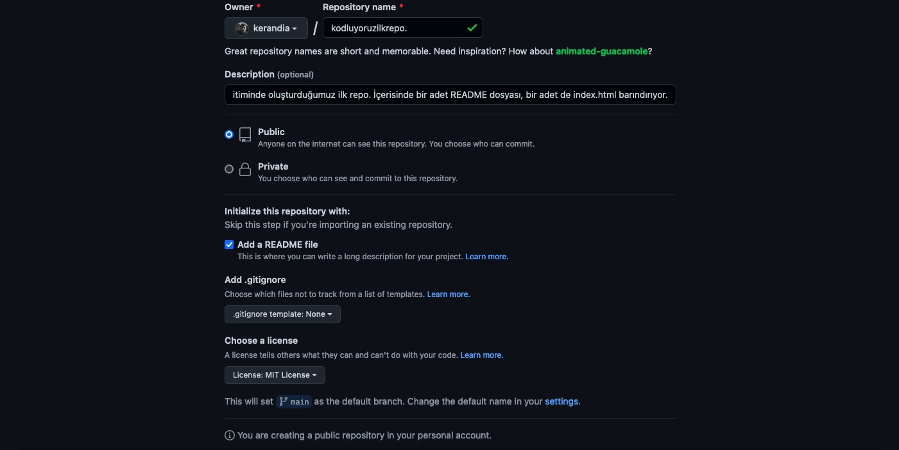

# kodluyoruzilkrepo
Kodluyoruz Eğitimi kapsamında açtığım ilk repo

# Installation

Öncelikle projeyi clonelayın. (Buraya sizin reponuzdan aldığınız link gelecek)

> git clone https://github.com/kerandia/kodluyoruzilkrepo.git

# Usage

Projeyi cloneladıktan sonra Visual Studio Code programında açınız.

Linux için:

> cd kodluyoruzilkrepo

>  code .

# Contributing

Pull requestler kabul edilir. Büyük değişiklikler için, lütfen önce neyi değiştirmek istediğinizi tartışmak için bir konu açınız.

# License

[MIT](https://choosealicense.com/licenses/mit/)

# Deneme

'''
Pyhthon
Print("hello world") 
'''
* Bullet
- Bullet
    - bullet

| Table| Deneme|
| :-- | --: |
| Try | 1|

